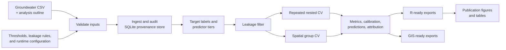

# Virtual Screening of Groundwater Exceedance Risk

Reproducible, leakage-controlled machine learning for prioritising groundwater wells for confirmatory monitoring in Ghana's Pru Basin.

The project provides a Rust command-line pipeline that turns groundwater chemistry measurements into validated exceedance-risk estimates. It compares practical predictor tiers, evaluates models under both repeated nested and spatially grouped cross-validation, records the full analysis in SQLite, and exports analysis-ready CSV files for statistical graphics and GIS workflows.

> **Research-use notice:** this is a screening and prioritisation tool. Its predictions do not replace laboratory testing, hydrogeological investigation, or regulatory decision-making.

## Why this pipeline exists

Groundwater risk models can appear accurate when a target analyte, a direct derivative of that analyte, or a strongly coupled proxy leaks into the predictors. This project makes leakage control an explicit, auditable part of the workflow:

- target-specific exclusion rules are declared in YAML;
- preprocessing is fitted within each training fold;
- hyperparameters are selected by inner cross-validation;
- conventional repeated nested CV and spatial group CV are reported separately;
- dummy classifiers are retained as performance baselines;
- every input, run, fold assignment, prediction, metric, and exclusion decision is recorded in SQLite;
- fixed random seeds and SHA-256 input hashes support reproducibility.

## Analysis workflow



## What is modelled

The configured screening targets are sodium (`Na`), chloride (`Cl`), total dissolved solids (`TDS`), boron (`B`), fluoride (`F`), and nitrate (`NO3`). Threshold values, units, provenance notes, and below-detection-limit handling are defined in [`configs/thresholds.yaml`](configs/thresholds.yaml).

Three predictor tiers represent increasing analytical effort:

| Tier | Intended setting | Candidate information |
|---|---|---|
| `Tier1_Field` | Rapid field screening | pH, temperature, EC, and coordinates |
| `Tier2_Reduced` | Reduced laboratory panel | Tier 1 plus major ions |
| `Tier3_Full` | Full chemistry panel | Tier 2 plus additional analytes and derived ionic ratios |

Before a model is fitted, [`configs/leakage_rules.yaml`](configs/leakage_rules.yaml) removes the target, target-derived variables, label-like fields, and other prohibited predictors. TDS additionally has EC-inclusive and EC-strict sensitivity variants.

The pipeline evaluates majority and stratified baselines, EC-only logistic regression, regularised logistic regression, random forest, and gradient-boosted trees. Model implementations are native Rust and deterministic under the configured seed.

## Repository layout

```text
.
├── Cargo.toml                 Rust package and dependencies
├── Cargo.lock                 Reproducible Rust dependency resolution
├── configs/
│   ├── config.yaml            Runtime, CV, spatial, and output settings
│   ├── leakage_rules.yaml     Target-wise leakage exclusions
│   └── thresholds.yaml        Exceedance definitions and BDL handling
├── src/                       Rust CLI, models, validation, CV, and exports
├── scripts/                   Python and R sensitivity/post-processing tools
├── manuscript/                R code for publication figures and tables
└── DECISIONS.md               Important implementation and interpretation notes
```

Raw data, databases, compiled binaries, and generated exports are intentionally not versioned. They are reproducible products or study inputs and are excluded by `.gitignore`.

## Requirements

### Core pipeline

- a current stable [Rust toolchain](https://www.rust-lang.org/tools/install) with Cargo;
- no separate SQLite installation—the Rust dependency is built with bundled SQLite.

### Optional post-processing

- Python 3 with `numpy`, `pandas`, `scikit-learn`, and `python-docx`;
- R with `DBI`, `RSQLite`, `ggplot2`, `dplyr`, `tidyr`, `readr`, `scales`, `patchwork`, `viridis`, `ggrepel`, `RColorBrewer`, and `gridExtra`.

Install the Python analysis dependencies with:

```bash
python -m pip install numpy pandas scikit-learn python-docx
```

## Quick start

Clone and build the release executable:

```bash
git clone https://github.com/dabdul-wahab1988/virtual-screening-of-groundwater-exceedance-risk.git
cd virtual-screening-of-groundwater-exceedance-risk
cargo build --release
```

On Linux and macOS, the executable is `target/release/gvs`; on Windows it is `target\release\gvs.exe`. The examples below use `cargo run --release --`, which works on every supported platform.

### 1. Prepare the inputs

Place the study CSV at `data/raw/pru.csv` and the analysis outline at `manuscript/Outline.txt`, or substitute your own paths in the commands.

At minimum, the CSV should contain:

- `SampleID`: unique well/sample identifier;
- `Dx`, `Dy`: longitude and latitude used for spatial validation;
- the configured target columns: `Na`, `Cl`, `TDS`, `B`, `F`, and `NO3`;
- predictor columns needed by the selected tiers, such as `pH`, `Temp.`, `EC`, `K`, `Mg`, `Ca`, `HCO3`, `SO4`, and `CO3`.

Plain `bdl` values are recognised case-insensitively. Review the detection-limit policy in `configs/thresholds.yaml` before analysing a new dataset.

### 2. Validate and ingest

```bash
cargo run --release -- validate-inputs \
  --data data/raw/pru.csv \
  --outline manuscript/Outline.txt \
  --thresholds configs/thresholds.yaml \
  --leakage configs/leakage_rules.yaml \
  --config configs/config.yaml

cargo run --release -- init-db \
  --db outputs/groundwater_screening.db

cargo run --release -- ingest-inputs \
  --data data/raw/pru.csv \
  --outline manuscript/Outline.txt \
  --thresholds configs/thresholds.yaml \
  --leakage configs/leakage_rules.yaml \
  --config configs/config.yaml \
  --db outputs/groundwater_screening.db
```

PowerShell users can either enter each command on one line or replace the Bash continuation character (`\`) with PowerShell's backtick.

### 3. Audit leakage and run the models

```bash
cargo run --release -- audit-leakage \
  --db outputs/groundwater_screening.db

cargo run --release -- run-pipeline \
  --db outputs/groundwater_screening.db \
  --config configs/config.yaml
```

For a focused run:

```bash
cargo run --release -- run-target \
  --target F \
  --tier Tier1_Field \
  --cv-mode Spatial_Group_CV \
  --db outputs/groundwater_screening.db
```

Use `cargo run --release -- --help` or append `--help` to any subcommand for the complete CLI reference.

### 4. Export results

```bash
cargo run --release -- export-r \
  --db outputs/groundwater_screening.db \
  --out outputs/r_exports

cargo run --release -- export-gis \
  --db outputs/groundwater_screening.db \
  --out outputs/gis_exports
```

The R export includes target prevalence, the leakage audit, fold-level and aggregate performance, out-of-fold predictions, calibration inputs, operational thresholds, threshold sensitivity, feature attributions, and the screening-priority table. The GIS export contains well-level priority points, target-specific probabilities, spatial-cluster metadata, and a checksum manifest.

## Configuration

[`configs/config.yaml`](configs/config.yaml) controls:

- repeated and spatial CV fold counts;
- the number of repeats and deterministic random seed;
- minimum positive cases required for modelling;
- coordinate fields and spatial clustering;
- enabled model families;
- output switches and paths.

For a new study, copy the configuration files, document every threshold source, review all target-wise leakage exclusions, and change the seed only when a deliberately independent run is required.

## Reproducibility and interpretation

- Input files are registered with SHA-256 hashes.
- Fold assignments and model metadata are persisted in SQLite.
- Imputation and scaling are learned inside each training fold.
- PR-AUC is the inner-CV tuning criterion because exceedances are imbalanced.
- Both discrimination and calibration metrics are exported.
- Spatial CV estimates geographic-transfer performance and should not be conflated with randomly stratified CV.
- Tree explanations are path-based/Saabas-style feature attributions, not exact interventional TreeSHAP values. See [`DECISIONS.md`](DECISIONS.md) for this and other implementation choices.
- Screening priority is based on the best completed non-dummy run, ordered primarily by mean PR-AUC and secondarily by Brier score.

To verify the Rust code locally:

```bash
cargo fmt --check
cargo test
cargo clippy --all-targets --all-features -- -D warnings
```

## Publication graphics

The scripts under `manuscript/` and `scripts/` consume the generated SQLite database or CSV exports. Some manuscript-era R scripts retain an absolute `PROJECT_ROOT`; update that variable for your checkout before running them. `scripts/make_q1_figures.R` resolves paths relative to the repository root and is the most portable entry point for the risk-alert figures.

## Citation

If you use this software, cite the associated groundwater virtual-screening manuscript and archive the exact repository commit used for analysis. A formal citation and DOI can be added here when the manuscript or a software release is published.

## License

No software license has yet been added. Unless a license is provided, copyright remains with the authors and reuse is not automatically granted. Open an issue in this repository for permissions or collaboration enquiries.
